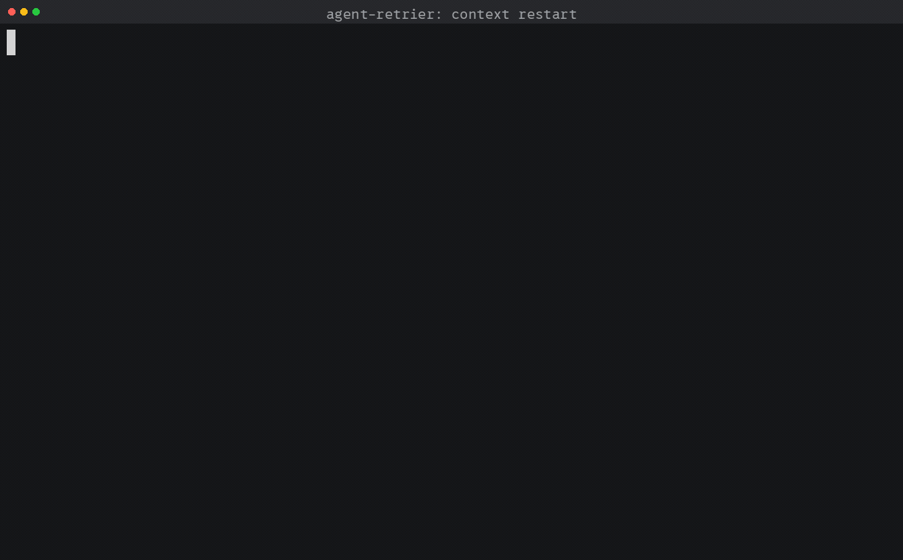

<p align="center">
  
</p>

# claude-retrier

[](https://github.com/a0s/claude-retrier/actions/workflows/test.yml)
[](LICENSE)

Keep a **Claude Code** or **codex** session going when it stops — for a usage
limit, or for a server that refused the turn — and restart it before it runs out
of context. `claude-retrier` wraps claude, `codex-retrier` wraps codex, and
neither is an afterthought: both agents get the same features, each driven the
way it actually works. One shell script, with no tmux and no daemon behind it.

```sh
brew install a0s/claude-retrier/claude-retrier
claude-retrier                       # instead of: claude
codex-retrier                        # instead of: codex
```

## Install

Homebrew, on macOS and Linux:

```sh
brew install a0s/claude-retrier/claude-retrier
```

Or take the file. It is self contained and there is no build step:

```sh
curl -fsSLO https://raw.githubusercontent.com/a0s/claude-retrier/main/claude-retrier.sh
chmod +x claude-retrier.sh
ln -s claude-retrier.sh codex-retrier            # optional: the codex name
```

Both names are installed whichever agents you have. `codex-retrier` is the same
file with codex as its default, and on a machine without codex all it does is
say so — which also means installing codex later needs nothing reinstalled.

Every version is also attached to a
[release](https://github.com/a0s/claude-retrier/releases), with the notes for it
in [CHANGELOG.md](CHANGELOG.md).

Uninstall is `brew uninstall claude-retrier`, or deleting the file. Nothing else
was touched: no shell rc edits, no launch agents, no background process.

Needs `bash` and `python3` 3.9+ ([details](docs/how-it-works.md#requirements)).

## Quick start

Run it wherever you would have run `claude` or `codex`:

```sh
claude-retrier                                   # instead of: claude
claude-retrier --resume 5e7a1c02-1a4b-4d99-b2f7  # any claude flag works
claude-retrier --cmd 'claude --model opus'       # or your own claude command
codex-retrier                                    # instead of: codex
codex-retrier resume --last                      # any codex arguments too
```

That is the whole setup for the usage-limit half. Start a session and forget
about it: the next time you look, the limit will have passed and the session
will have carried on.

The context restart is opt-in, because it clears a session's history and nobody
should get that by accident. Two lines turn it on for **both** agents:

```sh
export CR_CONTEXT_RESTART=1                                # arm it
export CR_HANDOFF_FILE='.claude-retrier/handoff-{id}.md'   # one file per session
```

No number to pick: each agent restarts at its own point — 51% of the window for
claude, the hard cap minus a 64k reserve for codex — because the right number
is genuinely not the same on both. `--cr-models` prints the table resolved
against your machine. `{id}` gives every session a handoff file of its own, so
a claude and a codex session running side by side in one repo can never write
over each other. Then `.gitignore` the `.claude-retrier/` directory and you are
done. → [minimal configs](docs/configuration.md#minimal-configs),
[context restart](docs/context-restart.md)

## What a restart looks like

The session fills up, the wrapper asks for a handoff file, checks it really was
written, sends `/clear`, and points the fresh session at the file. Four typed
steps, each announced in the terminal before it happens.



A real session with the threshold turned down so the whole sequence fits in a
few seconds; nothing in it is staged. The [`docs/demo/`](docs/demo/) directory
has the driver that recorded it — a codex recording is coming once its driver
catches up with the current codex-cli's TUI.

## What it does

- **Waits out a usage limit.** On `You've hit your session limit · resets 3pm`
  it sleeps until the reset and types `continue`. → [usage limits](docs/usage-limits.md)
- **Notices when a limit lifts early** — another account, an upgraded plan — and
  goes back to watching. → [usage limits](docs/usage-limits.md#when-a-limit-lifts-early)
- **Nudges a turn the server refused** (`Selected model is at capacity`), with a
  wait that doubles on each repeat. → [stalls](docs/stalls.md)
- **Restarts a session that is filling its context window**: handoff file,
  verified, `/clear`, fresh session reads it. Off until you switch it on.
  → [context restart](docs/context-restart.md)
- **Treats codex as a first-class agent, not a port**: its own command, its own
  threshold read off its own accounting, its own `$skill` syntax, and it stays
  ahead of codex's own compaction rather than racing it. → [codex](docs/codex.md)
- **Knows every model's window**, per model rather than one global percentage,
  and looks up one it has never heard of. → [the context window](docs/context-restart.md#the-context-window)
- **Keeps two sessions in one project apart**: each gets its own identity, its
  own handoff file, and its own tagged log lines, so neither one's restart can
  read or clear the other's. → [troubleshooting](docs/troubleshooting.md#two-sessions-in-one-project)
- **Runs your claude, not `claude`**: a binary, a command line, an alias or a
  function. → [custom command](docs/custom-command.md)
- **Never types over you.** An unsent draft or an unfinished turn makes it wait.
  → [how it works](docs/how-it-works.md#typing-safely)
- **Passes everything else through** — keys, colours, resizes, exit codes, flags —
  and keeps one dim mark in a corner. → [a sign of life](docs/how-it-works.md#a-sign-of-life)
- **Gets out of the way.** No python3, `claude -p`, or `CR_DISABLE=1`, and it
  execs plain claude. → [how it works](docs/how-it-works.md#getting-out-of-the-way)

## claude and codex, side by side

Everything works on both. Where the two differ, it is because the agents
themselves do — and the wrapper reads each one's own signals rather than
pretending they are the same:

| | Claude Code | codex |
|---|---|---|
| wrapper name | `claude-retrier` | `codex-retrier` (same file) |
| command setting | `CR_CLAUDE_CMD` / `--cmd` | `CR_CODEX_CMD` / `--cmd` |
| which session is mine | `~/.claude/sessions/<pid>.json`, read outright | the fold phrase's nonce, echoed into the rollout |
| context window | the model profile table, corrected by claude's own statusline | stated in every rollout row |
| restart point under `CR_CONTEXT_RESTART=1` | 51% of the window | the hard cap minus `CR_CODEX_RESERVE_TOKENS` |
| "the turn is over" | the transcript falling quiet | the rollout's own `task_complete` row |
| racing the agent's own compaction | not needed | codex's threshold is moved out of the way, and a turn about to be compacted is interrupted |
| naming a skill in a phrase | `/name` | `$name` — write `{skill:name}` and both work |

→ [codex](docs/codex.md), [how a setting is scoped](docs/configuration.md#how-to-read-this-page)

## Documentation

| page | what is in it |
|---|---|
| [Configuration](docs/configuration.md) | every setting, grouped by feature — which are shared, which are per-agent, which are per-model, and the minimal configs |
| [Context restart](docs/context-restart.md) | turning it on, what you see, the design, custom phrases, choosing a threshold, when nothing happens |
| [codex](docs/codex.md) | `codex-retrier`, rollouts, subcommands, codex context thresholds, staying ahead of its compaction |
| [Usage limits](docs/usage-limits.md) | waiting out a limit, early lifts, how a limit is detected, resuming a session |
| [Stalls](docs/stalls.md) | refused turns and the capacity nudge |
| [Custom command](docs/custom-command.md) | `--cmd`, `CR_CLAUDE_CMD`, aliases and functions |
| [How it works](docs/how-it-works.md) | the pty, transcripts, the badge, update checks, requirements, tests |
| [Troubleshooting](docs/troubleshooting.md) | where to look, and known limitations |

## Troubleshooting

Start with `~/.claude-retrier/log`, then see
[troubleshooting.md](docs/troubleshooting.md).

## License

MIT.
