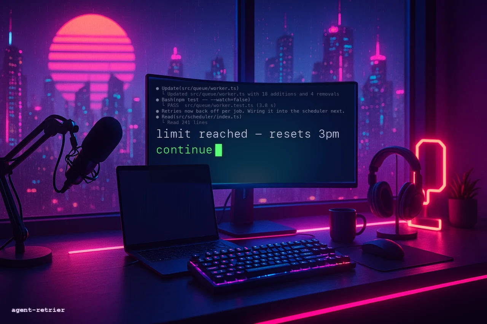

<p align="center">
  
</p>

# claude-retrier

[](https://github.com/a0s/claude-retrier/actions/workflows/test.yml)
[](LICENSE)

Auto-resume Claude Code after a usage limit. One shell script, no tmux, no daemon.

```sh
brew install a0s/claude-retrier/claude-retrier
claude-retrier                       # instead of: claude
```

When the session stops on `You've hit your session limit · resets 3pm`, the wrapper
waits until the reset and types `continue` for you. Everything else passes straight
through — keys, colours, resizes, exit codes.

## Install

**Homebrew** (macOS and Linux):

```sh
brew install a0s/claude-retrier/claude-retrier
```

**Or just take the file** — it is one self-contained script with no build step:

```sh
curl -fsSLO https://raw.githubusercontent.com/a0s/claude-retrier/main/claude-retrier.sh
chmod +x claude-retrier.sh
```

Uninstall is `brew uninstall claude-retrier`, or deleting the file. Nothing else
was touched: no shell rc edits, no launch agents, no background process.

## Your claude, not `claude`

Most people do not run stock `claude` for long. There is a `claude-work` and a
`claude-personal`, or an alias in `~/.zshrc` that pins a model, or a function that
sets a settings file first. Name yours with `--cmd` and the wrapper runs it:

```sh
claude-retrier --cmd claude-work                    # binary, or a name on PATH
claude-retrier --cmd ~/bin/claude-personal          # a path to anything runnable
claude-retrier --cmd 'claude --model opus'          # a whole command line
claude-retrier --cmd my-claude-alias                # an alias from your ~/.zshrc
claude-retrier --cmd my-claude-function             # a shell function, likewise
```

An alias or a function exists nowhere except inside an interactive shell that has
read your rc file, so that is where the wrapper looks when the name is not a file
it can run directly — once, at startup, lifting out the definition so that the
session itself runs from a plain shell. `claude-retrier --cmd X --cr-dump-argv`
prints exactly what will be executed. Set `CR_CLAUDE_CMD` instead of passing the
flag every time:

```sh
alias claude='claude-retrier --cmd claude-work'     # in ~/.zshrc
export CR_CLAUDE_CMD=claude-work                    # or, once, in your env
```

Everything after the command is claude's own — `claude-retrier --cmd claude-work
--resume` resumes, and a bare prompt stays a prompt. With no `--cmd` at all the
wrapper finds `claude` the way your shell would.

## Resuming a session

Claude's own flags pass straight through, so whatever you would type after
`claude` you type after `claude-retrier` instead:

```sh
claude-retrier --resume deb786e8-3006-4edf-b5e6-2ca73e25620e   # claude --resume <id>
claude-retrier --continue                                      # the last session here
claude-retrier --cmd claude-work --resume deb786e8-3006-4edf-b5e6-2ca73e25620e
```

A resumed session is watched exactly like a fresh one: the wrapper follows the
transcript claude is already appending to, so a limit hit an hour into the
resumed conversation is picked up the same way.

## How it works

`claude-retrier.sh` runs your claude on a pty it owns, so it can both read the output
and write input. That single fact removes the need for tmux (`capture-pane` +
`send-keys`), a detached monitor process, event marker files, and a launchd/systemd
reconciler.

It detects a limit on two channels:

1. **The transcript** — Claude Code writes `{"error":"rate_limit","isApiErrorMessage":true}`
   into `~/.claude/projects/<project>/<session>.jsonl`. Structured, unambiguous, primary.
2. **The screen** — pattern matching, used only when the transcript is unavailable.

Before typing anything it checks that Claude is not mid-turn and that you are not
typing yourself — it can see your keystrokes, so an unsent draft in the prompt box
is never overwritten.

Nothing is installed into your shell, no background process is left behind, and the
only thing written under your home directory is the log.

## Configuration

All optional, all environment variables:

| variable | default | |
|---|---|---|
| `CR_CLAUDE_CMD` | | your claude command (same as `--cmd`) |
| `CR_MESSAGE` | `continue` | what to type when the limit lifts |
| `CR_MARGIN_SEC` | `45` | extra wait past the stated reset time |
| `CR_MAX_ATTEMPTS` | `3` | sends per incident before giving up |
| `CR_USER_IDLE_SEC` | `20` | don't type while you are typing |
| `CR_SCRAPE` | `auto` | `auto` \| `always` \| `never` |
| `CR_SHELL` | `$SHELL` | shell that knows your aliases |
| `CR_LOG` | `~/.claude-retrier/log` | |
| `CR_DISABLE` | | `1` runs plain claude |

Detection patterns live in one array at the top of `claude-retrier.sh`; add a wording
and nothing else changes.

## Requirements

`bash` and `python3` (3.9+, standard library only). If either is missing, or claude
is invoked with `-p`, the wrapper execs claude unchanged — it never becomes the
reason your session won't start.

## Tests

```sh
./test/run.sh              # 129 tests: patterns, time parsing, transcript, state
                           # machine, custom commands, degradation, and end-to-end
                           # runs on a real pty
./test/run.sh --docker     # the same suite on Linux, from anywhere with docker
./test/run.sh test_time.py # just one file
```

## Limitations

- The screen-scraping fallback cannot tell a live banner from a session that is
  discussing one. It is off whenever the transcript is being written, which is
  the normal case.
- A weekly limit stated as a bare `resets Jul 22` with no year is assumed to be
  the next occurrence.
- An alias or function is read out of your rc file once, at startup, and run from
  a plain non-interactive shell afterwards. One that calls *another* alias defined
  in the same rc file will not find it. (bash 3.2, still what macOS ships as
  `/bin/bash`, cannot be asked for an alias body at all and falls back to running
  the alias through `bash -i`.)
- Windows is not supported (no pty).

Prior art: [claude-auto-retry](https://github.com/cheapestinference/claude-auto-retry),
whose issue tracker supplied most of the edge cases tested here.

MIT.
