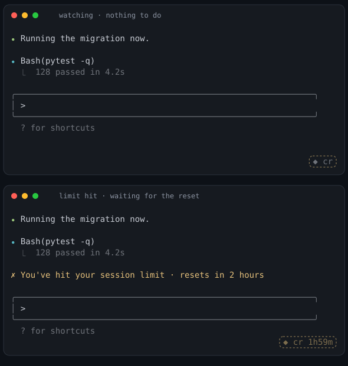

<p align="center">
  
</p>

# claude-retrier

[](https://github.com/a0s/claude-retrier/actions/workflows/test.yml)
[](LICENSE)

Keep a Claude Code or codex session going when it stops — for a usage limit, or
for a server that refused the turn — and restart it before it runs out of
context. One shell script, with no tmux and no daemon behind it.

```sh
brew install a0s/claude-retrier/claude-retrier
claude-retrier                       # instead of: claude
```

## What it does

- Wraps codex as well as Claude Code. `--agent codex` says so outright, or
  leave it on `auto` and it works out which one you are running from the
  command.
- Waits out a usage limit. The session stops on `You've hit your session limit ·
  resets 3pm`, and the wrapper sleeps until the reset and types `continue` for
  you.
- Nudges a turn the server refused. `Selected model is at capacity` states no
  reset time and schedules no way back — and on codex it takes every agent the
  session was running down with it — so the wrapper waits a minute and types
  `continue`, doubling the wait each time the refusal comes straight back.
- Notices when a limit lifts early. Switching accounts or upgrading a plan
  announces nothing, so it takes the session answering again as the answer,
  drops the countdown and goes back to watching.
- Restarts a session that is filling its context window. At a threshold you pick
  it asks Claude for a handoff file, checks the file is real, runs `/clear` and
  points the fresh session at it. This one is off until you switch it on.
- Never types over you. It owns the terminal, so it sees your keystrokes. An
  unsent draft in the prompt box is enough to make it wait, and so is a turn
  that has not finished.
- Passes everything else through: keys, colours, window resizes, exit codes, and
  any flag you would have handed to `claude`.
- Keeps one dim mark in a corner of the screen, with a countdown on it while it
  is waiting, so you can see it is still there.
- Gets out of the way. No python3, a `claude -p` batch run, `CR_DISABLE=1`: any
  of those and it execs plain claude rather than becoming the reason your
  session will not start.

## Quick start

Install it, then run it wherever you would have run `claude`:

```sh
claude-retrier                                   # instead of: claude
claude-retrier --resume 5e7a1c02-1a4b-4d99-b2f7  # any claude flag works
claude-retrier --cmd 'claude --model opus'       # or your own claude command
```

That is the whole setup for the usage-limit half. Start a session and forget
about it: the next time you look, the limit will have passed and the session
will have carried on.

The context restart is opt-in, because it clears a session's history and nobody
should get that by accident. One variable turns it on:

```sh
CR_CONTEXT_PCT=51 claude-retrier     # restart at 51% of the context window
```

See [Restarting a full context](#restarting-a-full-context) for what that does
and how to point it at a file of your own.

## Install

Homebrew, on macOS and Linux:

```sh
brew install a0s/claude-retrier/claude-retrier
```

Or take the file. It is self contained and there is no build step:

```sh
curl -fsSLO https://raw.githubusercontent.com/a0s/claude-retrier/main/claude-retrier.sh
chmod +x claude-retrier.sh
```

Every version is also attached to a
[release](https://github.com/a0s/claude-retrier/releases), with the notes for it
in [CHANGELOG.md](CHANGELOG.md).

Uninstall is `brew uninstall claude-retrier`, or deleting the file. Nothing else
was touched: no shell rc edits, no launch agents, no background process.

## Your claude, not `claude`

Most people do not run stock `claude` for long. There is a `claude-work` and a
`claude-personal`, or an alias in `~/.zshrc` that pins a model, or a function
that sets a settings file first. Name yours with `--cmd` and the wrapper runs
it:

```sh
claude-retrier --cmd claude-work                    # binary, or a name on PATH
claude-retrier --cmd ~/bin/claude-personal          # a path to anything runnable
claude-retrier --cmd 'claude --model opus'          # a whole command line
claude-retrier --cmd my-claude-alias                # an alias from your ~/.zshrc
claude-retrier --cmd my-claude-function             # a shell function, likewise
```

An alias or a function exists nowhere except inside an interactive shell that
has read your rc file, so that is where the wrapper looks when the name is not a
file it can run directly. It looks once, at startup, and lifts the definition
out so the session itself runs from a plain shell. `claude-retrier --cmd X
--cr-dump-argv` prints exactly what will be executed. Set `CR_CLAUDE_CMD`
instead of passing the flag every time:

```sh
alias claude='claude-retrier --cmd claude-work'     # in ~/.zshrc
export CR_CLAUDE_CMD=claude-work                    # or, once, in your env
```

Everything after the command belongs to claude. `claude-retrier --cmd
claude-work --resume` resumes, and a bare prompt stays a prompt. With no `--cmd`
at all the wrapper finds `claude` the way your shell would.

## codex

Point `--cmd` at codex and the wrapper follows it the same way it follows
claude:

```sh
claude-retrier --cmd codex
claude-retrier --agent codex --cmd 'codex --model gpt-5.6-sol'
```

`--agent` (or `CR_AGENT`) says which one you are running; the default, `auto`,
works it out from the command, so `claude-retrier --cmd codex` needs nothing
else. `--cr-agent` is the same flag under the prefix the other wrapper options
carry. `claude` and `codex` are the only two values.

codex writes one JSONL "rollout" per thread under
`$CODEX_HOME/sessions/<yyyy>/<mm>/<dd>/` (`CODEX_HOME` defaults to `~/.codex`),
and it states outright several things Claude Code's transcript only implies:
where a turn started and ended, the exact size of the context window
(`model_context_window`), what the last request was sent with, and the reason a
turn ended. So on codex the context window is read rather than guessed from a
model name, and `CR_CONTEXT_WINDOW` is not needed.

Every project's rollouts share one tree, and a codex subagent gets a rollout of
its own. The wrapper reads only the rollout whose head says `thread_source:
user` and whose `cwd` is the directory it is running in — reading a subagent's
would report a limit this terminal never hit, and a context that is not ours to
restart. When codex is given `--cd`, that directory is the one followed.

Most of what codex can be asked to do is not a session at all. `codex exec`,
`codex login`, `codex mcp` and the rest run untouched, the way `claude -p`
already does; `codex resume` and `codex fork` are sessions, and are wrapped.

The context percentage runs a few points ahead of the one in codex's own status
line: codex subtracts a fixed baseline before working out its percentage and the
wrapper does not, so a restart set at, say, 51% fires slightly before codex would
call the session that full. Early is the safe direction.

## The stall

A usage limit says when it lifts, and the wrapper waits that out. The other way
a session stops says nothing at all: the server refuses the turn outright —
`Selected model is at capacity. Please try a different model.` — with no reset
time and nothing scheduling a way back. On codex that refusal ends the whole
turn, which takes every agent the session was running down with it, and leaves
the session sitting at an idle prompt with no sign anything is wrong.

So the wrapper waits a minute and types `continue`, the same thing a person
watching the screen would do. A repeat refusal doubles the wait — 60s, 120s,
240s — up to `CR_STALL_MAX_WAIT_SEC`, because a service that has just said it is
full does not want to be asked again every minute. Any turn that finishes ends
the streak, and the next stall starts back at a minute. The usual gates still
apply: nothing is typed while the session is mid-turn or while there is an
unsent draft in the prompt box.

| variable | default | |
|---|---|---|
| `CR_STALL_WAIT_SEC` | `60` | first wait after a stall; `0` switches stalls off |
| `CR_STALL_BACKOFF` | `2` | multiply the wait by this for each repeat |
| `CR_STALL_MAX_WAIT_SEC` | `600` | the longest a stall wait gets |
| `CR_STALL_MAX_ATTEMPTS` | `8` | consecutive stalls before it stops nudging |

Detection patterns for a refused turn live in `CR_STALL_PATTERNS`, next to the
other pattern arrays at the top of `claude-retrier.sh`. That array is kept
narrow on purpose: a wrong stall is a message typed into a live session for no
reason.

## Resuming a session

Claude's own flags pass straight through, so whatever you would type after
`claude` you type after `claude-retrier` instead:

```sh
claude-retrier --resume deb786e8-3006-4edf-b5e6-2ca73e25620e   # claude --resume <id>
claude-retrier --continue                                      # the last session here
claude-retrier --cmd claude-work --resume deb786e8-3006-4edf-b5e6-2ca73e25620e
```

A resumed session is watched exactly like a fresh one. The wrapper follows the
transcript claude is already appending to, so a limit hit an hour into the
resumed conversation is picked up the same way.

## How it works

`claude-retrier.sh` runs your claude on a pty it owns, so it can read the output
and write input at the same time. That single fact removes the need for tmux
(`capture-pane` plus `send-keys`), a detached monitor process, event marker
files, and a launchd or systemd reconciler.

It detects a limit on two channels. The first is the transcript: Claude Code
writes `{"error":"rate_limit","isApiErrorMessage":true}` into
`~/.claude/projects/<project>/<session>.jsonl`, and codex writes its own JSONL
"rollout" under `$CODEX_HOME/sessions/<yyyy>/<mm>/<dd>/`, stating outright the
reason a turn ended and the size of the context window. Either is structured,
unambiguous, and the one the wrapper trusts. The second is the screen, matched
against patterns, and it is only used when the transcript is unavailable. One
command is never read that way at all: started on `claude agents`, the wrapper
switches the screen channel off for the run. Every card on that roster is a
different session's last line, a limit shown there belongs to somebody else and
is usually hours old, and opening a card scrolls that session's history — old
banners included — past the same scraper. A wait the screen did schedule stays
open to it: a banner stating an earlier reset takes over, so a wrong one cannot
hold the session past the moment it could have gone back to work.

Before typing anything it checks that Claude is not mid-turn and that you are
not typing yourself. It can see your keystrokes, so an unsent draft in the
prompt box is never overwritten.

A wait also ends when the limit does. Log into another account with `/login`,
upgrade the plan, or simply get your quota back early: nothing announces any of
that, so the wrapper takes the session answering again as the answer.

Nothing goes into your shell config, no background process outlives the session,
and the only file it writes under your home directory is the log.

## Restarting a full context

The other way a session stops is by filling up its context window, and then
there is a ritual: ask Claude to write down where it got to, `/clear`, hand the
note to the fresh session. People do that by hand, several times a day, at
whatever moment they happen to notice.

Set a threshold and the wrapper does it for you.

### Turning it on

One variable. It is off until you set it, and nothing below happens without it:

```sh
CR_CONTEXT_PCT=51 claude-retrier          # restart at 51% of the context window
```

Two more make it fit a project you actually work in:

```sh
export CR_CONTEXT_PCT=51
export CR_HANDOFF_FILE=scratchpad/RESUME.md      # relative to cwd, .gitignore it
export CR_RESUME_MSG='Read `scratchpad/RESUME.md` and carry on from it.'
```

Put those three in your shell rc, or in a `direnv` file for one repo, and there
is nothing else to run.

### What you will see

Nothing at all, until the session gets near the threshold. Then the badge in the
corner starts showing the percentage, `◆ cr 47%`, so you can tell whether the
number you picked is a sensible one before it ever fires.

When it does fire, four things are typed into your session, and the wrapper
prints a dim line before each of them so you are never left wondering what just
happened:

```
[claude-retrier] context is filling up; asking for a handoff
[claude-retrier] handoff verified; clearing the context
[claude-retrier] context cleared; unfolding the handoff
[claude-retrier] context restarted: 700k down to 5k
```

Behind those, `~/.claude-retrier/log` has the whole story with numbers:

```
claude-opus-5: a 1.0M context window (the model), restarting at 510k
context is 700k of a 1.0M window (70%, threshold 510k); folding up
asking for a handoff into scratchpad/RESUME.md (attempt 1/2, marker HANDOFF-4acfe679)
handoff accepted: 3417 bytes ending in HANDOFF-4acfe679, turn closed with end_turn
handoff verified; clearing the context with /clear
unfolding from scratchpad/RESUME.md
context restarted: 700k down to 5k
```

The whole thing takes a minute or two, nearly all of it spent waiting for Claude
to finish writing the file and for the transcript to fall quiet afterwards.

### The four steps

1. **Fold.** `CR_HANDOFF_MSG` asks Claude to stop, start nothing new, write a
   complete handoff into `CR_HANDOFF_FILE`, and finish that file with a one-time
   marker.
2. **Check.** The next section, which is the whole design.
3. **`/clear`.** Claude Code's own command. The process, the pty, the MCP
   connections and the warm prompt cache all stay; only the history goes.
4. **Unfold.** `CR_RESUME_MSG` points the fresh session at the file.

Nothing is counted on this side. Every assistant row in the transcript carries
the API's own `usage`, and `input + cache_creation + cache_read` is the prompt
that was sent. The check rides on a row the wrapper had already parsed, so it
costs two comparisons and happens only when the transcript actually grew. The
denominator comes from the model slug in the same row.

### Why `/clear` is the last thing it will do

Clearing a session that was not folded up loses the work with nothing written
down, so `/clear` goes out only when four independent things agree:

- the handoff file **ends with the marker generated for this attempt**, which is
  proof the write ran to the end. "Done" in the chat would only be proof that
  the model believes it did. The marker is different every time, so one left
  behind by a previous attempt cannot be mistaken for this one's;
- the runtime recorded the turn as `end_turn`, not `max_tokens` (cut off by
  length) or `refusal`;
- the file is newer than the request for it and over `CR_HANDOFF_MIN_BYTES`;
- the session's own transcript has stopped growing for `CR_ROOT_IDLE_SEC`. That
  is how "the turn is over" is asked here, because in a session that keeps
  background work running the screen never goes quiet.

If any of them is missing the wrapper asks for the fold again, and then gives
up. Giving up leaves the session untouched: it can still fall back on Claude Code's own
compaction, which is a far better outcome than a history thrown away on a
promise. If `/clear` did go out and the context did not actually fall, the
feature switches itself off for the rest of the session rather than typing into
a full one for ever.

A usage limit landing in the middle suspends the restart rather than cancelling
it. Every clock it runs on stops for the duration, because a weekly limit is
days long and would otherwise expire a fifteen-minute fold timeout from the
inside. Its attempt budget is not spent on the world's problems either, and when
the quota comes back the step that was interrupted is re-sent. `continue` is the
wrong instruction at every step of a restart but the last one.

Background agents keep running across a restart, which is what you want and why
nothing here waits for them. Idle is measured on the session's own transcript,
and work started elsewhere writes its own.

### Writing your own phrases

The two phrases are yours. `{file}` is substituted in both and `{marker}` in the
folding one, and each must be a single line, because a newline submits it.

```sh
export CR_HANDOFF_MSG='Stop here, start nothing new, and write everything the next session needs into `{file}` because it will not remember this one. Last line of that file: {marker}, alone, written after the rest.'
export CR_RESUME_MSG='/my-skill continue from `scratchpad/RESUME.md`'
```

If you write your own, keep three things in it. No new work, because the session
is about to end and anything started now is lost. "For a session that will not
remember this one", without which you get notes that only make sense to someone
who was there. And the marker as the last line of the file, written last: that
is the only thing standing between a half-written note and a cleared session.

A slash command works as a resume phrase. It goes out with the extra care
described under `CR_SLASH_ENTER` below.

### When nothing happens

Look in `~/.claude-retrier/log`. In order of likelihood:

- No `context restart armed` line at all: `CR_CONTEXT_PCT` never reached the
  wrapper. Check that it is exported, and that your `--cmd` wrapper is not
  starting claude in a scrubbed environment.
- `restart step held: ...` is working as intended. It will not type over you
  mid-sentence, and it will not interrupt a turn that is still running.
- `a 200k context window` for a model you expected to have 1M: the line says
  where the figure came from — most likely `CLAUDE_CODE_DISABLE_1M_CONTEXT`.
  Name the window yourself with `CR_CONTEXT_WINDOW=1M`.
- `the window is unknown ... stays disarmed`, and `cr window?` in the corner:
  this build has never heard of the model and could not look it up either. It
  will not guess — a guessed window is how a session gets folded at 12% full —
  so either `CR_CONTEXT_WINDOW=1M`, or set `CR_CONTEXT_TOKENS`, which needs no
  window at all.
- `restart aborted at handoff_sent: ...` means the fold produced nothing usable,
  and the message names which of the four checks failed. The session was left
  alone.
- The percentage in the badge never moves: the wrapper reads the figures off
  assistant rows, so it has nothing to show until the session answers something.
  A transcript that already existed when the wrapper started is seeded rather
  than replayed, so a `--continue` session reports its size from its next turn.

### Settings

| variable | default | |
|---|---|---|
| `CR_CONTEXT_PCT` | `0` | restart at this % of the window; `0` is off |
| `CR_CONTEXT_TOKENS` | `0` | absolute threshold (`500k` is fine); beats the % |
| `CR_CONTEXT_WINDOW` | `auto` | `auto` \| `200k` \| `1M` \| a number |
| `CR_MODEL_LOOKUP` | `1` | look an unfamiliar model up; `0` never touches the network |
| `CR_MODEL_CACHE` | `~/.claude-retrier/windows.json` | what the lookup learned |
| `CR_MODEL_CACHE_TTL_SEC` | `604800` | a week |
| `CR_HANDOFF_FILE` | `.claude-retrier/handoff.md` | where the fold is written |
| `CR_HANDOFF_MSG` | (see `--cr-help`) | the folding phrase; `{file}`, `{marker}` |
| `CR_RESUME_MSG` | ``Read `{file}` and continue from it.`` | the unfolding phrase |
| `CR_CLEAR_CMD` | `/clear` | |
| `CR_HANDOFF_MARKER` | `HANDOFF` | prefix; a nonce is appended to it |
| `CR_HANDOFF_MIN_BYTES` | `200` | a shorter file is not a handoff |
| `CR_HANDOFF_ATTEMPTS` | `2` | folds attempted before giving up |
| `CR_ROOT_IDLE_SEC` | `20` | transcript quiet this long means the turn is over |
| `CR_HANDOFF_TIMEOUT_SEC` | `900` | per step, and frozen while a limit runs |
| `CR_STEP_GAP_SEC` | `3` | between `/clear` and the resume phrase |
| `CR_CONTEXT_COOLDOWN_SEC` | `600` | silence after any restart |
| `CR_CONTEXT_MAX_CYCLES` | `0` | `0` = no cap; a fuse against a loop |
| `CR_SLASH_ENTER` | `2` | Enters sent for a `/command` |

Half the window is a good place to start for a threshold. It leaves the folding
turn plenty of room to think and to read files, which is exactly the
turn you do not want cramped. Much above 80% and the fold itself starts
struggling for space; much below 30% and you restart more often than you get
work done. Watch the badge for a day and move it.

`CR_CONTEXT_WINDOW=auto` reads the model slug out of the transcript and looks
it up. It narrows to 200k if `CLAUDE_CODE_DISABLE_1M_CONTEXT` or
`CLAUDE_CODE_MAX_CONTEXT_TOKENS` is set in the environment claude is started
with, and it widens if the session is ever seen past the window it assumed.
Name a number if your setup narrows the window some way the wrapper cannot see.

A model the built-in table does not list is not guessed at. A point release
resolves to its family (`claude-fable-5-1` is whatever `claude-fable-5` is), and
anything left over is looked up: the Models API when `ANTHROPIC_API_KEY` is set
— a Claude subscription is not an API key, so most sessions skip this — and the
published models table otherwise. That happens in a worker thread, so nothing
waits on it, and the answer is cached in `CR_MODEL_CACHE` for a week. Until it
arrives the percentage trigger is disarmed and the corner says `cr window?`;
`CR_MODEL_LOOKUP=0` keeps the wrapper entirely offline, and then an unknown
model needs `CR_CONTEXT_WINDOW` or `CR_CONTEXT_TOKENS` from you.

This is the one thing in the wrapper that talks to the network, and only ever
about a model name: it sends a slug and reads back a number. Guessing instead is
what this replaced — assuming 200k for a slug that turned out to be a 1M model
folded a session that was 12% full.

`CR_SLASH_ENTER` exists because typing a `/` opens Claude Code's command list, and in a TUI
that is a real hazard: Enter into an open list can pick the highlighted entry
instead of submitting what was typed. Measured against Claude Code 2.1.222, one
Enter runs `/clear` and there is no confirmation step. So a slash command gets a
longer pause, letting the list settle on the exact match, and then two Enters,
the second purely as insurance for a build that behaves differently. That second
one costs nothing, because an Enter into an empty input box submits nothing,
which is also measured. `CR_SLASH_ENTER=1` turns it off.

Add the handoff file to your `.gitignore`. It is a scratch note about one
session and it is rewritten from scratch every time.

## Updates

It checks once a day whether there is a newer release, and says so in two dim
lines before the session starts:

```
[claude-retrier] claude-retrier 1.9.0 → 1.10.0 is out
                 brew upgrade a0s/claude-retrier/claude-retrier
```

The command is the one that updates the copy you are running — `brew upgrade`
from a cellar install, `git -C <clone> pull` from a clone, the releases page for
a file you downloaded. Nothing waits on the network for it: the notice is read
out of a cache the previous run wrote, and the check that refreshes it runs in
the background after claude is already up, so the first run after installing
says nothing at all.

| variable | default | |
|---|---|---|
| `CR_UPDATE_CHECK` | `1` | `0` never checks and never mentions it |
| `CR_UPDATE_NOTICE_SEC` | `2` | how long the notice stays before claude starts |
| `CR_UPDATE_TTL_SEC` | `86400` | between checks |
| `CR_UPDATE_CACHE` | `~/.claude-retrier/update.json` | |
| `CR_UPDATE_REPO` | `a0s/claude-retrier` | whose releases to read |
| `CR_UPDATE_BREW_FORMULA` | `a0s/claude-retrier/claude-retrier` | named in the brew command |

## A sign of life

A wrapper you cannot see is indistinguishable from a wrapper that died an hour
ago. So there is one mark, dim, in a corner of the screen: `◆ cr` while it is
watching, the time left while it is waiting out a limit, and `◆ cr held` when
the reset has passed but you are still at the keyboard.

<p align="center">
  
</p>

Nothing is reserved from Claude. The badge is painted over the finished frame in
the gaps between repaints, with the cursor saved and restored around it and the
last column left empty so it can never wrap the screen. Claude paints over it
and it comes back a moment later: about forty bytes, a few times a second at
most, and never a byte into the session itself.

```sh
CR_BADGE=0 claude-retrier                  # off
CR_BADGE_POS=top-right claude-retrier      # any of the four corners
CR_BADGE_LABEL=retrier claude-retrier      # your own word next to the mark
```

The picture above is not a mockup. `python3 docs/badge-shot.py` runs the real
wrapper over a stand-in that prints one Claude-shaped frame, replays what the
wrapper wrote through the terminal emulator the tests use, and renders the
screen that came out.

## Configuration

All optional, all environment variables:

| variable | default | |
|---|---|---|
| `CR_CLAUDE_CMD` | | your claude command (same as `--cmd`) |
| `CR_AGENT` | `auto` | `auto` \| `claude` \| `codex` — which one you are running (same as `--agent`) |
| `CR_MESSAGE` | `continue` | what to type when the limit lifts |
| `CR_MARGIN_SEC` | `45` | extra wait past the stated reset time |
| `CR_MAX_ATTEMPTS` | `3` | sends per incident before giving up |
| `CR_USER_IDLE_SEC` | `20` | don't type while you are typing |
| `CR_TYPING_MAX_SEC` | `900` | but not past this, with an empty input box |
| `CR_RESUME_SEC` | `15` | claude working this long during a wait ends it |
| `CR_DRAFT_GRACE_SEC` | `600` | an untouched draft this old stops blocking |
| `CR_SCRAPE` | `auto` | `auto` \| `always` \| `never` |
| `CR_BADGE` | `1` | `0` hides the corner mark |
| `CR_BADGE_POS` | `bottom-right` | also `bottom-left`, `top-right`, `top-left` |
| `CR_BADGE_LABEL` | `cr` | the word next to the mark |
| `CR_SHELL` | `$SHELL` | shell that knows your aliases |
| `CR_LOG` | `~/.claude-retrier/log` | |
| `CR_UPDATE_CHECK` | `1` | `0` never checks for a newer release ([more](#updates)) |
| `CR_DISABLE` | | `1` runs plain claude |

The context-restart settings have [a table of their own](#settings), and all of
them do nothing until `CR_CONTEXT_PCT` is set.

Detection patterns live in one array at the top of `claude-retrier.sh`. Add a
wording and nothing else changes.

## Requirements

`bash` and `python3` (3.9 or newer, standard library only). If either is
missing, or claude is invoked with `-p`, the wrapper execs claude unchanged. It
never becomes the reason your session will not start.

## Tests

```sh
./test/run.sh              # 429 tests: patterns, time parsing, transcript, model
                           # windows, update checks, state machine, the badge, custom
                           # commands, degradation, and end-to-end runs on a real pty
                           # (rendered through a terminal emulator, so "what the user
                           # sees" is asserted)
./test/run.sh --docker     # the same suite on Linux, from anywhere with docker
./test/run.sh test_time.py # just one file
```

## Limitations

- The screen-scraping fallback cannot tell a live banner from a session that is
  discussing one. It is off whenever the transcript is being written, which is
  the normal case.
- A weekly limit stated as a bare `resets Jul 22` with no year is assumed to be
  the next occurrence.
- An alias or function is read out of your rc file once, at startup, and run
  from a plain non-interactive shell afterwards. One that calls *another* alias
  defined in the same rc file will not find it. (bash 3.2, still what macOS
  ships as `/bin/bash`, cannot be asked for an alias body at all and falls back
  to running the alias through `bash -i`.)
- The context restart reads its figures from one transcript at a time, the one
  this terminal's session writes. Another live session under the same working
  directory can, briefly, be the file that grew last.
- Windows is not supported (no pty).

Prior art: [claude-auto-retry](https://github.com/cheapestinference/claude-auto-retry),
whose issue tracker supplied most of the edge cases tested here.

MIT.
